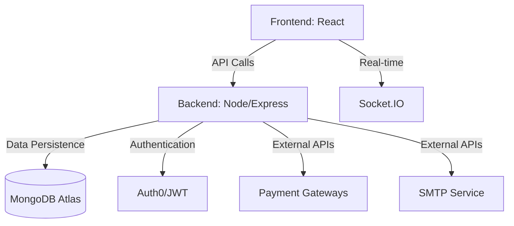
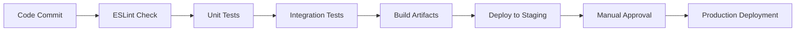
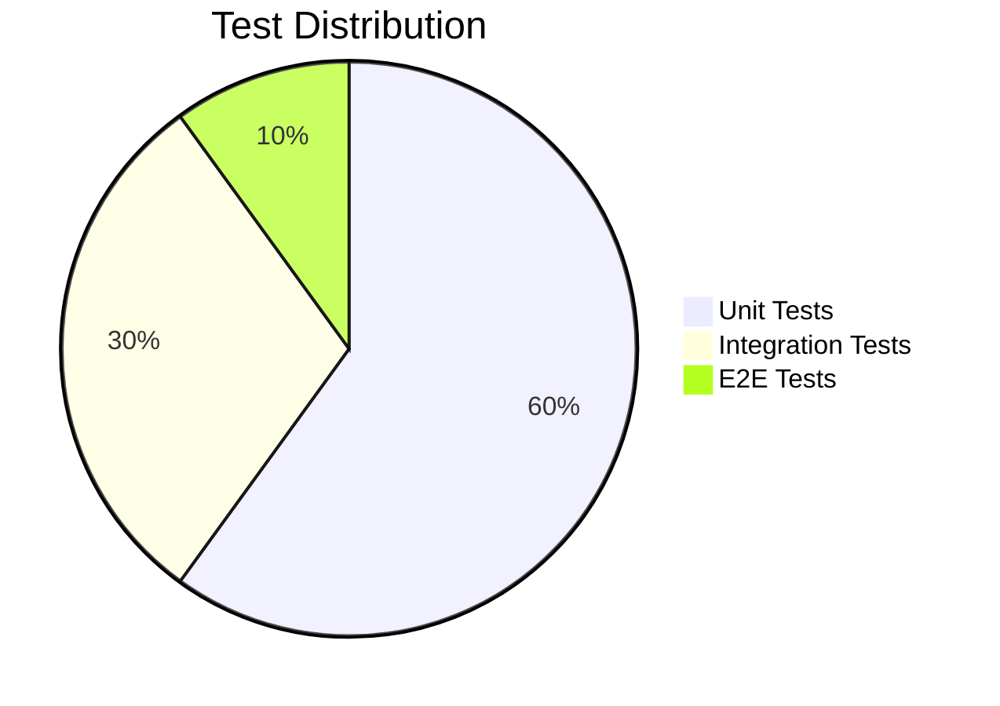

# Ultimate School Management System (M.E.R.N) - Academix


## Next-Generation Academic Management Platform

A comprehensive, modular MERN stack solution revolutionizing school administration with cutting-edge features for academic scheduling, attendance tracking, payroll management, and student lifecycle management.

## Table of Contents
- Key Features
- System Architecture
- Data Models
- Installation Guide
- Deployment
- Development Workflow
- Testing Strategy
- Security
- Performance Optimization
- Contributing
- License
- Contact

## Key Features

### Core Functionalities
- **Multi-Calendar System**: Support for Semesters, Trimesters, Quarters, and Custom Academic Periods
- **Hierarchical Structure**: Subject → Course → Class with Intelligent Room/Teacher Assignment
- **Advanced Role System**: Granular permissions for Teachers, Nurses, Admin, and Custom Roles
- **Comprehensive Tracking**: Attendance, Behavioral Notes, Medical Records, and Academic Progress
- **Automated Payroll**: Complex salary calculations with bonuses and deductions

### Premium Features
- **AI-Powered Scheduling**: Conflict-free automatic timetable generation
- **Real-time Analytics Dashboard**: Visualize key metrics and trends
- **Mobile Responsive**: Fully functional on all devices
- **API-First Design**: RESTful endpoints with Swagger documentation
- **WebSocket Integration**: Real-time notifications and updates

## System Architecture

### High-Level Architecture




### 🧩 Component Diagram


## 📊 Data Models


### 🏫 School Structure
*(Diagram Placeholder)*

**🔑 Key Relationships:**
- 1:M SchoolYear → Periods
- 1:M Subject → Courses
- 1:M Course → Classes
- M:N Students ↔ Classes (through Enrollment)
- 1:1 Teacher ↔ Payroll

## 🛠️ Installation Guide

### 🖥️ System Requirements
- Node.js 16+
- MongoDB 5.0+
- Redis 6.0+ (for caching)
- 4GB RAM minimum
- 10GB Disk Space

### 📥 Installation Steps
```bash
git clone https://github.com/your-repo/school-management-enterprise.git
cd school-management-enterprise
cp .env.example .env
npm run setup
npm run db:seed
npm run dev
```

## 🚀 Deployment

### 🐳 Docker Deployment
```bash
docker-compose up -d --build
```

### ☁️ Cloud Deployment Options

**AWS Elastic Beanstalk**
```bash
eb init
eb create --sample
eb deploy
```

**Heroku**
```bash
heroku create
git push heroku main
```

**Azure App Service**
```bash
az webapp up --sku F1 --name <app-name>
```

## 🔧 Development Workflow

### 🛠️ Scripts Overview
| Command | Description |
| ------- | ----------- |
| npm run dev | Start development servers |
| npm run build | Production build |
| npm run test | Run all tests |
| npm run lint | Run ESLint |
| npm run format | Format with Prettier |
| npm run storybook | Launch UI component library |

## 🔄 CI/CD Pipeline




## 🧪 Testing Strategy

**🧩 Test Pyramid** 




### 🛡️ Test Coverage
- Frontend: Jest + React Testing Library (95%+ coverage)
- Backend: Mocha + Chai (90%+ coverage)
- E2E: Cypress (Critical paths only)

Run all tests:
```bash
npm test
```

## 🔒 Security

### 🛡️ Security Features
- JWT authentication with refresh tokens
- RBAC with ABAC extensions
- Field-level encryption
- Audit logging
- Rate limiting
- CORS strict policy
- Helmet for secure HTTP headers

### 🔐 Security Checklist
- OWASP Top 10 mitigated
- Regular dependency audits
- Secret rotation every 90 days
- Quarterly penetration tests

## 📈 Performance Optimization
- Redis caching
- Lazy loading and code splitting
- Pagination
- Gzip compression
- CDN asset delivery
- Database indexing

**📊 Benchmarks:**
| Operation | Avg Response Time |
| --------- | ----------------- |
| GET /classes | 120ms |
| POST /attendance | 250ms |
| GET /reports | 800ms (cached: 150ms) |

## 🤝 Contributing
1. Fork the repository
2. Create a feature branch: `git checkout -b feature/amazing-feature`
3. Commit changes: `git commit -m 'Add amazing feature'`
4. Push: `git push origin feature/amazing-feature`
5. Open a Pull Request

**Code Standards:**
- Airbnb JavaScript Style Guide (ESLint)
- Prettier formatting
- Conventional commits
- JSDoc documentation

## 📜 License
This project is licensed under the MIT License - see the LICENSE.md file for details.

## 📞 Contact
- **Maintainer:** [Your Name]
- **Email:** your.email@example.com
- **Slack:** Join our workspace
- **Issues:** GitHub Issues


